# [UniControl](https://arxiv.org/abs/2305.11147) [](https://arxiv.org/pdf/2305.11147.pdf) [](https://canqin001.github.io/UniControl-Page/)
<div align="center">
    <a></a>
    <a>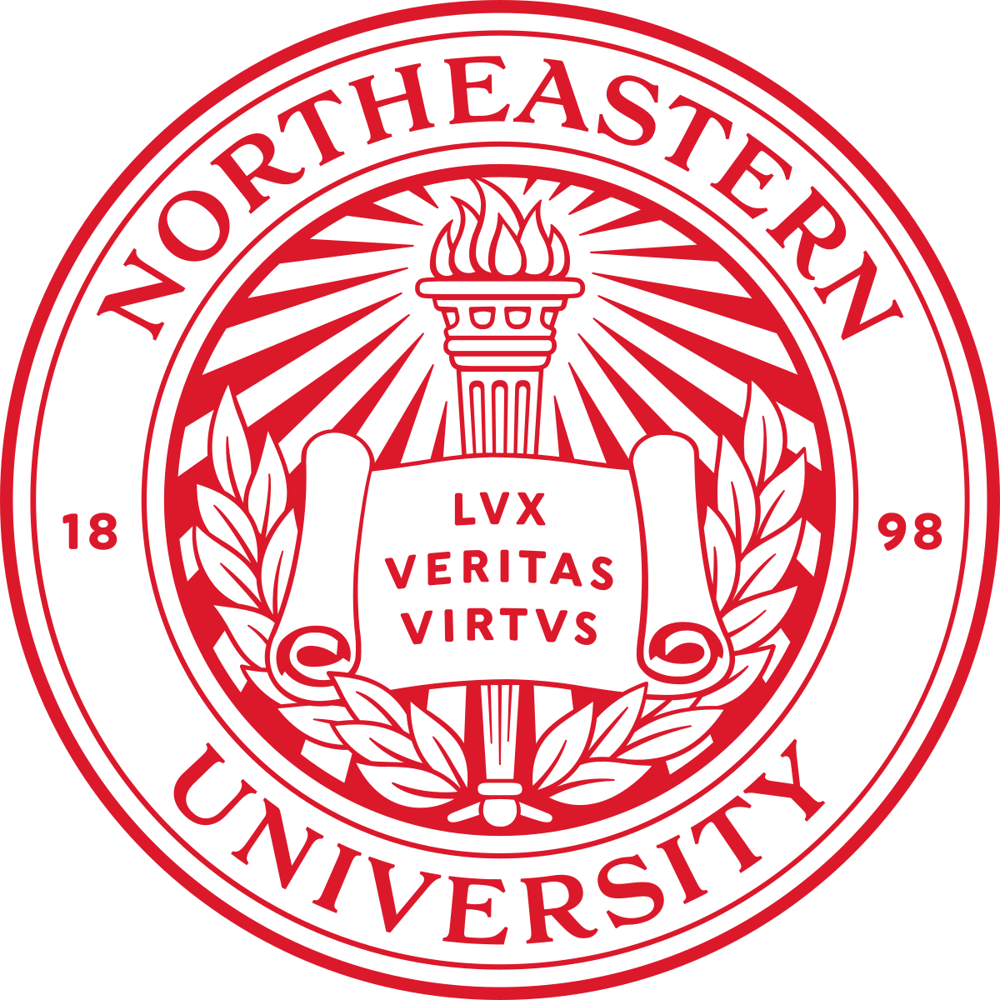</a>
    <a>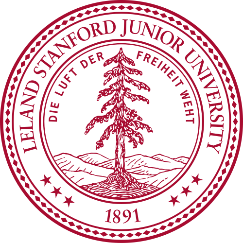</a>
</div>

This repository is for the paper:
> **[UniControl: A Unified Diffusion Model for Controllable Visual Generation In the Wild](https://arxiv.org/abs/2305.11147)** \
> Can Qin <sup>1,2</sup>, Shu Zhang<sup>1</sup>, Ning Yu <sup>1</sup>, Yihao Feng<sup>1</sup>, Xinyi Yang<sup>1</sup>, Yingbo Zhou <sup>1</sup>, Huan Wang <sup>1</sup>, Juan Carlos Niebles<sup>1</sup>, Caiming Xiong <sup>1</sup>, Silvio Savarese <sup>1</sup>, Stefano Ermon <sup>3</sup>, Yun Fu <sup>2</sup>,  Ran Xu <sup>1</sup> \
> <sup>1</sup> Salesforce AI <sup>2</sup> Northeastern University  <sup>3</sup> Stanford Univerisy \
> Work done when Can Qin was an intern at Salesforce AI Research.


## Introduction
We introduce **UniControl**, a new generative foundation model that consolidates a wide array of controllable condition-to-image (C2I) tasks within a singular framework, while still allowing for arbitrary language prompts. UniControl enables pixel-level-precise image generation, where visual conditions primarily influence the generated structures and language prompts guide the style and context. To equip UniControl with the capacity to handle diverse visual conditions, we augment pretrained text-to-image diffusion models and introduce a task-aware HyperNet to modulate the diffusion models, enabling the adaptation to different C2I tasks simultaneously. Experimental results show that UniControl often surpasses the performance of single-task-controlled methods of comparable model sizes. This control versatility positions UniControl as a significant advancement in the realm of controllable visual generation. 


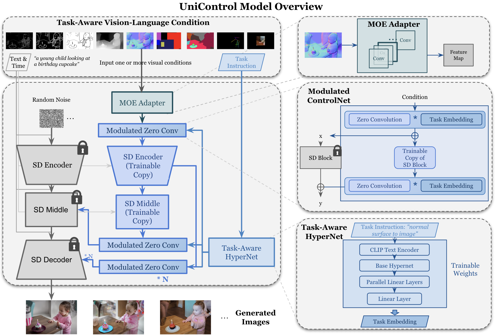


## Updates
* **05/18/23**: ***[UniControl](https://arxiv.org/abs/2305.11147) paper uploaded to arXiv.***
* **05/26/23**: ***UniControl inference code and checkpoint open to public.*** 
* **05/28/23**: ***Latest UniControl model [checkpoint](https://console.cloud.google.com/storage/browser/_details/sfr-unicontrol-data-research/unicontrol.ckpt) (1.4B #params, 5.78GB) updated.*** 
* **06/08/23**: ***Latest UniControl model [checkpoint](https://console.cloud.google.com/storage/browser/_details/sfr-unicontrol-data-research/unicontrol.ckpt) updated which supports 12 tasks now (***Canny***, ***HED***, ***Sketch***, ***Depth***, ***Normal***, ***Skeleton***, ***Bbox***, ***Seg***, ***Outpainting***, ***Inpainting***, ***Deblurring*** and ***Colorization***) !*** 
* **06/08/23**: ***Training dataset ([MultiGen-20M](https://console.cloud.google.com/storage/browser/sfr-unicontrol-data-research/dataset)) is fully released.*** 
* **06/08/23**: ***Training code is public.***:blush: 


## MultiGen-20M Datasets
There are more than 20M image-prompt-condition triplets [here](https://console.cloud.google.com/storage/browser/sfr-unicontrol-data-research/dataset) with total size ***> 2TB***. It includes all 12 tasks (`Canny, HED, Sketch, Depth, Normal, Skeleton, Bbox, Seg, Outpainting, Inpainting, Deblurring, Colorization`) which are fully released.

## Instruction
### Environment Preparation
Setup the env first (need to wait a few minutes).
```
conda env create -f environment.yaml
conda activate unicontrol
```
### Checkpoint Preparation
The checkpoint of pre-trained UniControl model is saved at `./ckpts/unicontrol.ckpt`.
```
cd ckpts
wget https://storage.googleapis.com/sfr-unicontrol-data-research/unicontrol.ckpt 
```

If you want to train from scratch, please follow the ControlNet to prepare the checkpoint initialization. ControlNet provides a simple script for you to achieve this easily. If your SD filename is `./ckpts/v1-5-pruned.ckpt` and you want the script to save the processed model (SD+ControlNet) at location `./ckpts/control_sd15_ini.ckpt`, you can just run:
```
python tool_add_control.py ./ckpts/v1-5-pruned.ckpt ./ckpts/control_sd15_ini.ckpt
```

### Data Preparation 
Please download the training dataset ([MultiGen-20M](https://console.cloud.google.com/storage/browser/sfr-unicontrol-data-research/dataset)) to `./multigen20m`. Please:
```
cd multigen20m
gsutil -m cp -r gs://sfr-unicontrol-data-research/dataset ./
```
Then unzip the all the files.

### Model Training (CUDA 11.0 and Conda 4.12.0 work)
Training from Scratch:
``` 
python train_unicontrol.py --ckpt ./ckpts/control_sd15_ini.ckpt --config ./models/cldm_v15_unicontrol_v11.yaml --lr 1e-5
```

Model Finetuning:
``` 
python train_unicontrol.py --ckpt ./ckpts/unicontrol.ckpt  --config ./models/cldm_v15_unicontrol.yaml --lr 1e-7
```

### Model Inference (CUDA 11.0 and Conda 4.12.0 work)
For different tasks, please run the code as follows. If you meet OOM error, please decrease the "--num_samples".

Canny to Image Generation:
```
python inference_demo.py --ckpt ./ckpts/unicontrol.ckpt --task canny
```

HED Edge to Image Generation:
```
python inference_demo.py --ckpt ./ckpts/unicontrol.ckpt --task hed 
```

HED-like Skech to Image Generation:
```
python inference_demo.py --ckpt ./ckpts/unicontrol.ckpt --task hedsketch
```

Depth Map to Image Generation:
```
python inference_demo.py --ckpt ./ckpts/unicontrol.ckpt --task depth 
```

Normal Surface Map to Image Generation:
```
python inference_demo.py --ckpt ./ckpts/unicontrol.ckpt --task normal
```

Segmentation Map to Image Generation:
```
python inference_demo.py --ckpt ./ckpts/unicontrol.ckpt --task seg
```


Human Skeleton to Image Generation:
```
python inference_demo.py --ckpt ./ckpts/unicontrol.ckpt --task openpose
```


Object Bounding Boxes to Image Generation:
```
python inference_demo.py --ckpt ./ckpts/unicontrol.ckpt --task bbox
```


Image Outpainting:
```
python inference_demo.py --ckpt ./ckpts/unicontrol.ckpt --task outpainting
```


Image Inpainting:
```
python inference_demo.py --ckpt ./ckpts/unicontrol.ckpt --task inpainting
```


Image Deblurring:
```
python inference_demo.py --ckpt ./ckpts/unicontrol.ckpt --task blur
```


Image Colorization:
```
python inference_demo.py --ckpt ./ckpts/unicontrol.ckpt --task grayscale
```

### Gradio Demo ([App Demo Video](https://github.com/salesforce/UniControl/issues/1), CUDA 11.0 and Conda 4.12.0 work)
We have provided gradio demos for different tasks to use. The example images are saved at `./test_imgs`. 
<div align="center">
    <a>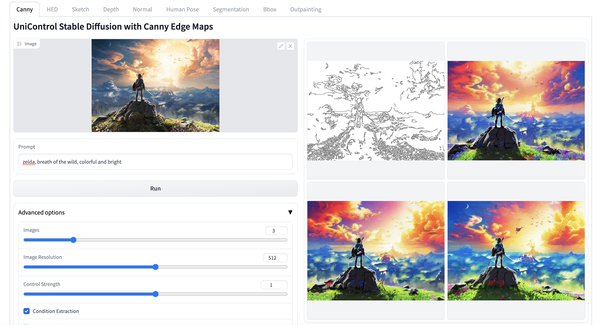</a>
</div>

For all the tasks (`Canny, HED, Sketch, Depth, Normal, Human Pose, Seg, Bbox, Outpainting, Colorization, Deblurring, Inpainting`) please run the following code: 
```
python app/gradio_all_tasks.py
```

<div align="center">
    <a></a>
</div>

We support the direct condition-to-image generation (as shown above). Please unmark the `Condition Extraction` in UI if you want to upload condition image directly. 

***

Or, we provide the task-specifc gradio demos:

<div align="center">
    <a>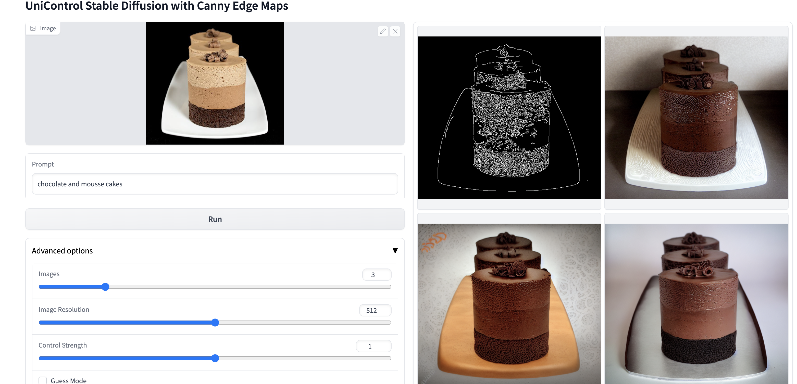</a>
</div>

Canny to Image Generation:
```
python app/gradio_canny2image.py
```

***

<div align="center">
    <a>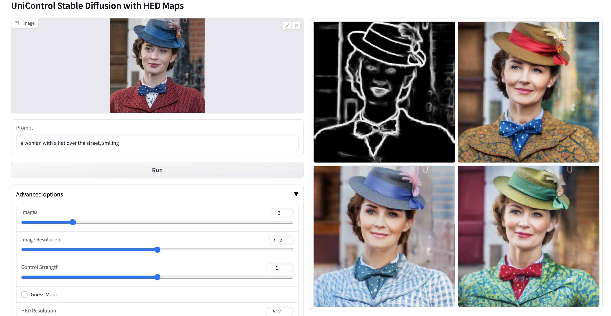</a>
</div>

HED Edge to Image Generation:
```
python app/gradio_hed2image.py
```

***

<div align="center">
    <a>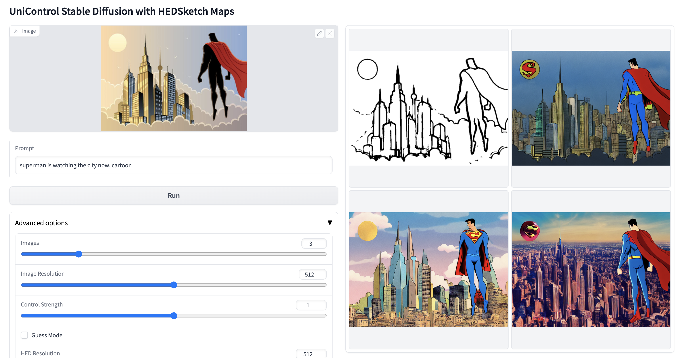</a>
</div>

HED-like Skech to Image Generation:
```
python app/gradio_hedsketch2image.py
```

***

<div align="center">
    <a>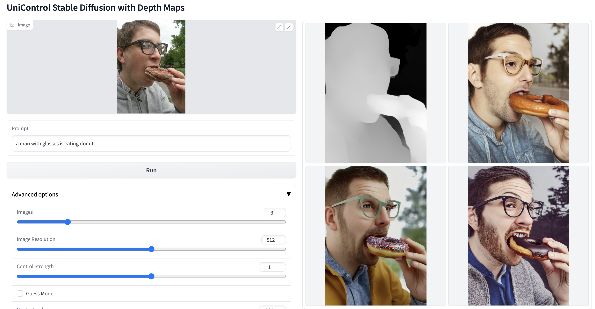</a>
</div>

Depth Map to Image Generation:
```
python app/gradio_depth2image.py
```

***

<div align="center">
    <a>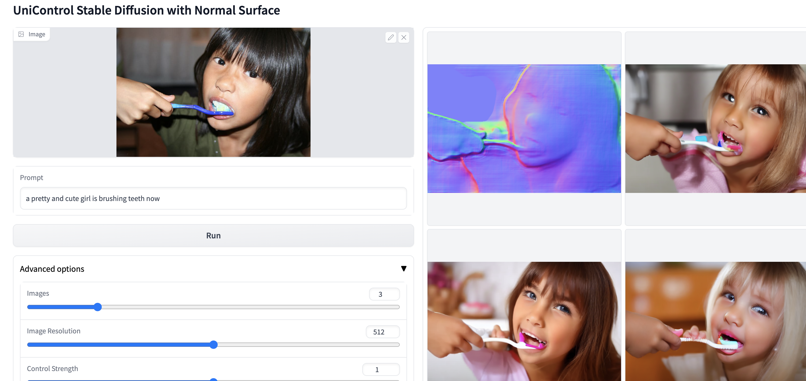</a>
</div>

Normal Surface Map to Image Generation:
```
python app/gradio_normal2image.py
```

***

<div align="center">
    <a>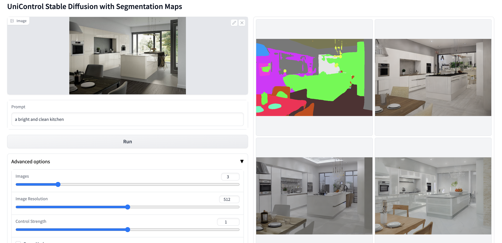</a>
</div>

Segmentation Map to Image Generation:
```
python app/gradio_seg2image.py
```

***

<div align="center">
    <a>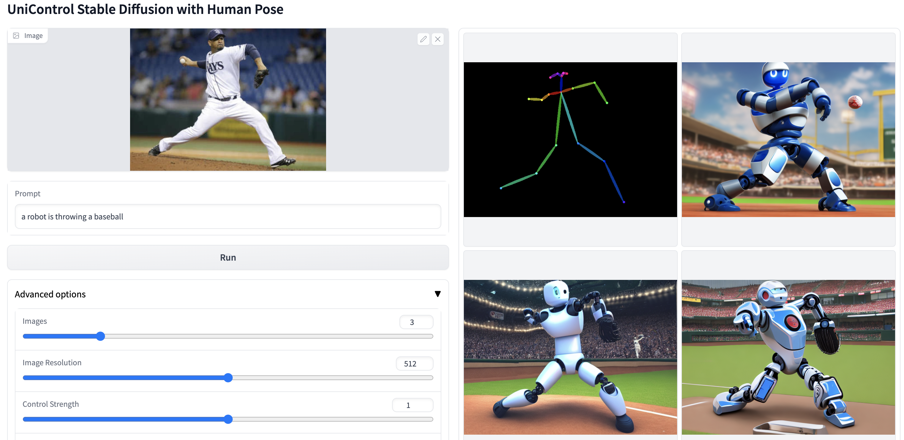</a>
</div>

Human Skeleton to Image Generation:
```
python app/gradio_pose2image.py
```

***

<div align="center">
    <a>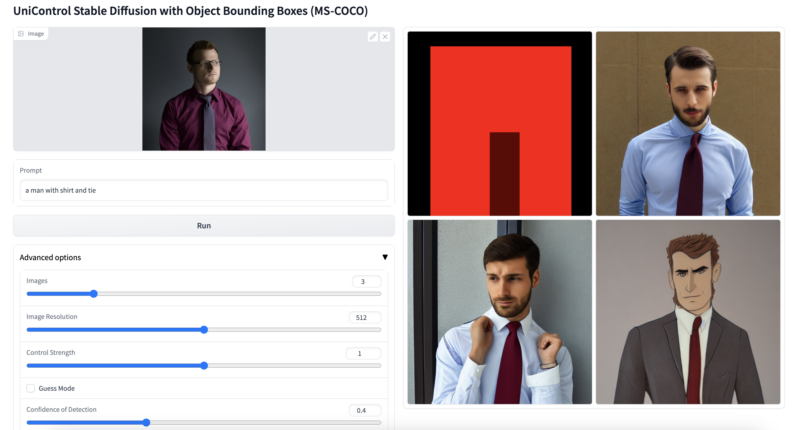</a>
</div>

Object Bounding Boxes to Image Generation:
```
python app/gradio_bbox2image.py
```

***

<div align="center">
    <a>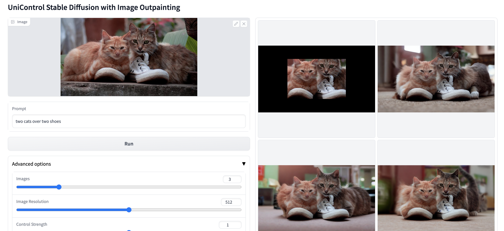</a>
</div>

Image Outpainting:
```
python app/gradio_outpainting.py
```


***

<div align="center">
    <a>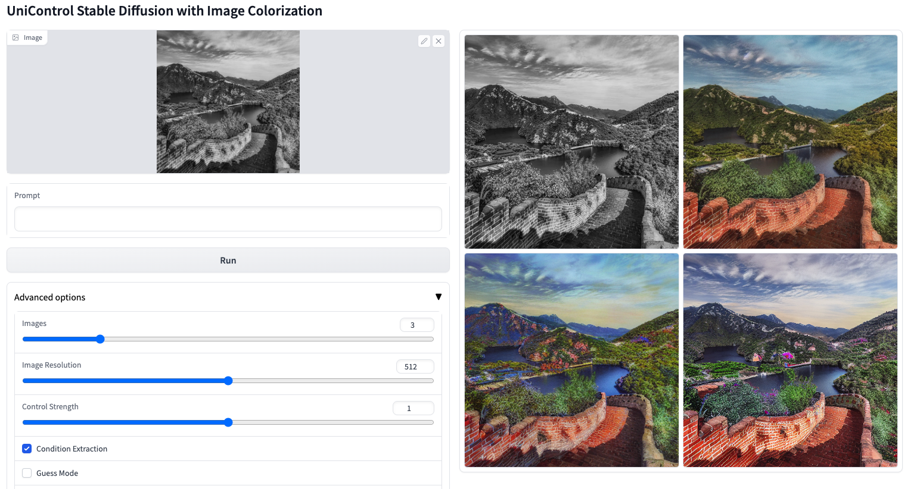</a>
</div>

Image Colorization:
```
python app/gradio_colorization.py
```


***

<div align="center">
    <a>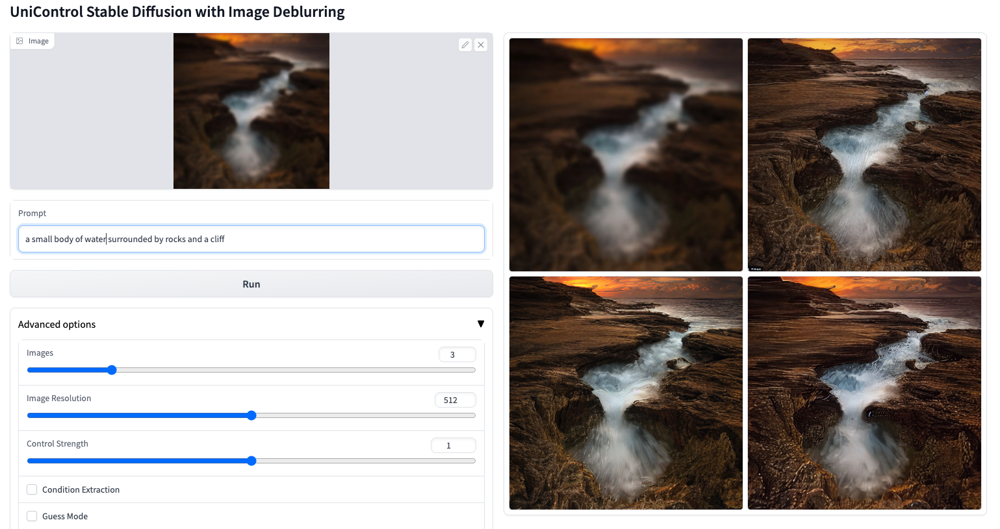</a>
</div>

Image Deblurring:
```
python app/gradio_deblur.py
```


***

<div align="center">
    <a>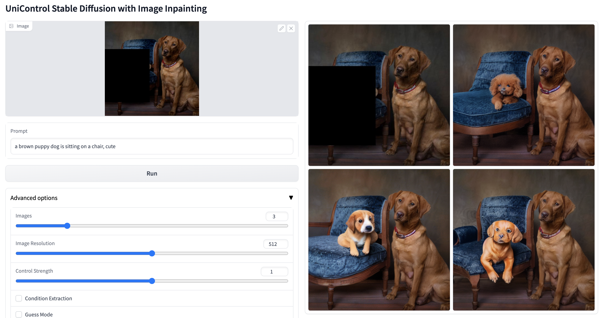</a>
</div>

Image Inpainting:
```
python app/gradio_inpainting.py
```


## To Do
- [x] Data Preparation
- [x] Pre-training Tasks Inference
- [x] Gradio Demo
- [x] Model Training
- [ ] HF Space

## Tips
* Negative prompts are very useful sometimes: `monochrome, lowres, bad anatomy, worst quality, low quality` are example negative prompts.

* UniControl can work well on some tasks (ie, Colorization and Deblurring) without ANY text prompts.

* If OOM, let `--num_samples 1` may be helpful

## Citation
If you find this project useful for your research, please kindly cite our paper:

```bibtex
@article{qin2023unicontrol,
  title={UniControl: A Unified Diffusion Model for Controllable Visual Generation In the Wild},
  author={Qin, Can and Zhang, Shu and Yu, Ning and Feng, Yihao and Yang, Xinyi and Zhou, Yingbo and Wang, Huan and Niebles, Juan Carlos and Xiong, Caiming and Savarese, Silvio and others},
  journal={arXiv preprint arXiv:2305.11147},
  year={2023}
}
```

## Acknowledgement
*This project is built upon the gaint sholders of ControlNet and Stable Diffusion. Great thanks to them!*

Stable Diffusion https://github.com/CompVis/stable-diffusion

ControlNet https://github.com/lllyasviel/ControlNet 

StyleGAN3 https://github.com/NVlabs/stylegan3
    
